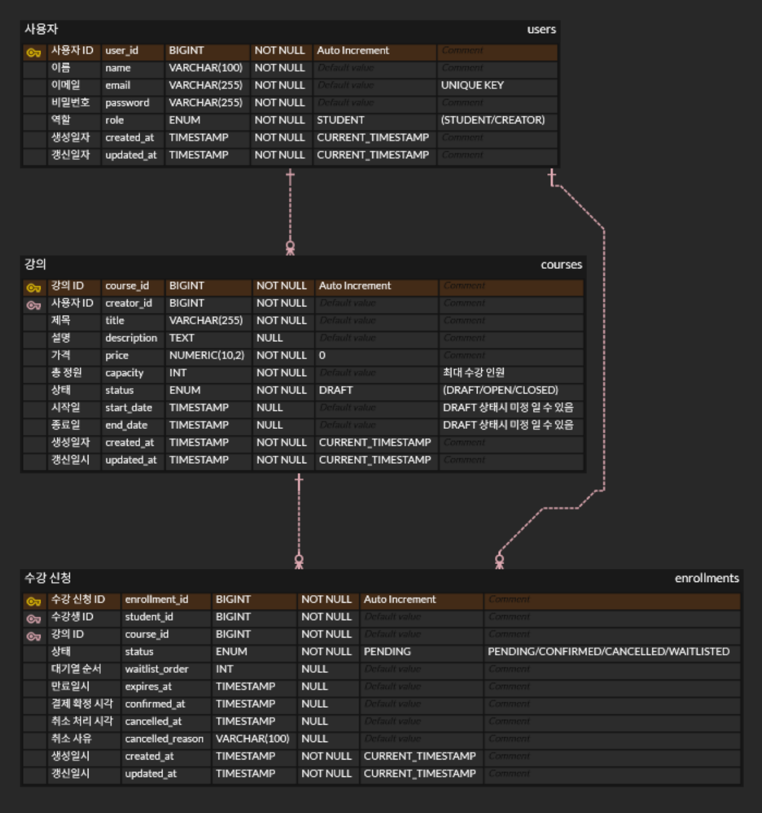

# 수강 신청 시스템 (Course Registration System)

## 프로젝트 개요

> **과제 A** — 크리에이터(강사)가 강의를 개설하고, 클래스메이트(수강생)가 수강 신청·결제·취소를 수행하는 CRUD + 비즈니스 규칙형 백엔드 서비스
---

## 기술 스택

### Java 25

Kotlin 대비 기존 Java 생태계와의 호환성이 높고, 팀 내 학습 비용 없이 바로 활용할 수 있다. Java 21에서 도입된 Virtual Threads가 점진적으로 안정화되고 있으며, OS 스레드를 직접
점유하지 않는 경량 스레드 모델로 I/O 대기 구간에서 스레드 고갈 위험을 줄일 수 있다. 동시성 처리 전략은 아직 확정 전이나, Virtual Threads 활용 가능성을 열어두고 Java 25를 선택했다.

### Spring Boot 4.0.5

Quarkus·Micronaut 등 경량 프레임워크 대비 생태계 범위와 레퍼런스가 압도적으로 넓다. JPA·Redis·Validation·Security 등 이 프로젝트에서 필요한 모든 기능을 Spring 생태계
안에서 일관된 방식으로 조합할 수 있다. Java 25 Virtual Threads도 별도 설정 없이 통합 지원한다.

### Spring Data JPA (Hibernate)

MyBatis 대비 SQL을 직접 작성하지 않고 객체 중심으로 도메인을 모델링할 수 있다. `@EntityListeners` 기반 Auditing으로 생성일·수정일을 자동 기록하고, `BaseEntity` 상속으로
공통 필드를 한곳에서 관리한다. 다만 복잡한 집계 쿼리는 JPQL 또는 QueryDSL을 병행할 필요가 있다.

### PostgreSQL 18.3

MySQL 대비 MVCC 구현이 정교하고, 행 단위 잠금(`SELECT FOR UPDATE`)과 SKIP LOCKED를 통한 동시성 제어가 강력하다. ACID 트랜잭션을 엄격하게 보장해 정원 초과 방지의 DB 레벨
안전망으로 적합하다.

### Redis 8.6.2

Memcached 대비 다양한 자료구조와 TTL 기반 만료 정책을 지원한다. 이 프로젝트에서는 두 가지 목적으로 사용한다. 첫째, 분산 락으로 동시 신청 요청을 직렬화해 정원 초과를 방지한다. 둘째, 강의 조회
결과를 인메모리에 캐싱해 반복 DB I/O를 줄인다.

### SpringDoc OpenAPI 3.0.5

Swagger 애너테이션을 별도로 관리하는 방식과 달리, 코드 변경 시 API 문서가 자동으로 갱신된다. Spring MVC 컨트롤러 구조를 그대로 분석해 문서를 생성하므로 코드와 문서 간 불일치가 발생하지 않는다.

### Spring Validation

직접 if 분기로 검증 로직을 작성하는 방식 대비, `@Valid`·`@NotNull`·`@Size` 등 애너테이션 선언만으로 입력 검증을 처리할 수 있다. 검증 실패는 `GlobalExceptionHandler`가
일괄 처리해 Controller 코드가 비즈니스 로직에만 집중할 수 있다.

### GitHub Actions

Jenkins 대비 별도 서버 없이 GitHub 저장소와 즉시 연동된다. PR 생성 시 빌드·테스트가 자동 실행되어 로컬 환경 차이로 발생하는 문제를 병합 전에 발견할 수 있다.

---

## 실행 방법

## API 목록 및 예시

## 데이터 모델 설명

### ERD

<!-- ERD 캡처 이미지 -->

### 테이블 설명

#### `users`

| 컬럼                          | 타입           | 설명                    |
|-----------------------------|--------------|-----------------------|
| `user_id`                   | BIGINT (PK)  | 자동 증가 식별자             |
| `name`                      | VARCHAR(100) | 사용자 이름                |
| `email`                     | VARCHAR(255) | 로그인 이메일 (유니크)         |
| `password`                  | VARCHAR(255) | 비밀번호                  |
| `role`                      | VARCHAR(20)  | `STUDENT` / `CREATOR` |
| `created_at` / `updated_at` | TIMESTAMP    | JPA Auditing 자동 기록    |

#### `courses`

| 컬럼                          | 타입                  | 설명                          |
|-----------------------------|---------------------|-----------------------------|
| `course_id`                 | BIGINT (PK)         | 자동 증가 식별자                   |
| `creator_id`                | BIGINT (FK → users) | 강의를 개설한 크리에이터               |
| `title`                     | VARCHAR(255)        | 강의 제목                       |
| `description`               | TEXT                | 강의 설명                       |
| `price`                     | NUMERIC(12, 0)      | 수강료 (원 단위)                  |
| `capacity`                  | INT (nullable)      | 최대 수강 정원 (`null` = 무제한)     |
| `status`                    | VARCHAR(20)         | `DRAFT` / `OPEN` / `CLOSED` |
| `start_date` / `end_date`   | TIMESTAMP           | 수강 기간                       |
| `created_at` / `updated_at` | TIMESTAMP           | JPA Auditing 자동 기록          |

#### `enrollments`

| 컬럼                          | 타입                    | 설명                                                   |
|-----------------------------|-----------------------|------------------------------------------------------|
| `enrollment_id`             | BIGINT (PK)           | 자동 증가 식별자                                            |
| `student_id`                | BIGINT (FK → users)   | 수강 신청한 학생                                            |
| `course_id`                 | BIGINT (FK → courses) | 신청 대상 강의                                             |
| `status`                    | VARCHAR(20)           | `PENDING` / `CONFIRMED` / `CANCELLED` / `WAITLISTED` |
| `waitlist_order`            | INT                   | 대기열 순서 (WAITLISTED 상태일 때만 사용)                        |
| `confirmed_at`              | TIMESTAMP             | 결제 확정 시각                                             |
| `cancelled_at`              | TIMESTAMP             | 취소 처리 시각                                             |
| `created_at` / `updated_at` | TIMESTAMP             | JPA Auditing 자동 기록                                   |

### 주요 제약 조건

- `courses.capacity IS NULL OR capacity > 0` — CHECK 제약 (`null` = 무제한 정원)
- `courses.price >= 0` — CHECK 제약
- `enrollments (student_id, course_id) WHERE status IN ('PENDING', 'CONFIRMED', 'WAITLISTED')` — 부분 유니크 인덱스로 활성 상태 중복 신청
  방지, CANCELLED 이력은 보존 ([Q3](docs/QUESTIONS.md))

---

## 요구사항 해석 및 가정

> [!NOTE]
> 명세에 명시되지 않은 부분은 아래와 같이 해석하였다.

- **사용자 인증**: 별도 인증 시스템 없이 `userId`, `role`을 헤더로 전달하는 방식으로 단순화
- **결제 시스템**: 외부 PG 연동 없이 `PATCH /confirm` 호출 시 상태를 `CONFIRMED`로 변경하는 것으로 대체
- **강의 삭제**: `DRAFT` 상태에서만 삭제 허용, `OPEN` 이후는 상태 변경만 가능.
---

## 설계 결정과 이유

### 공통 응답 포맷 — `BaseResponse<T>`

별도로 정의된 응답 포맷이 존재하지 않아 API별 데이터 구조를 직접 정의하였으며, 프론트엔드 통합 시 응답 메시지를 일관되게 해석할 수 있도록 `{ success, data, error, timestamp }`
구조로 통일하였다.

### AOP 기반 로깅

Controller / Service 실행 시간을 횡단 관심사로 분리했다. 500ms 초과 시 `WARN` 레벨로 기록되어 별도 APM 없이도 느린 요청을 빠르게 식별할 수 있다.

### Checkstyle — 네이버 코딩 컨벤션 기반 직접 정의

표준으로 채택할 수 있는 공통 규칙이 없어 [네이버 코딩 컨벤션 v1.2](https://naver.github.io/hackday-conventions-java/)를 기반으로 프로젝트 전용 Checkstyle
규칙(`config/checkstyle/liveklass-checkstyle-rules.xml`)을 직접 정의하였다.

코드 리뷰 시 스타일 지적에 소모되는 비용을 없애고, 규칙 위반 시 **빌드 자체를 실패**시켜 컨벤션 준수를 강제한다. 주요 적용 규칙은 다음과 같다.

| 규칙   | 내용                                                 |
|------|----------------------------------------------------|
| 네이밍  | 패키지 소문자, 클래스 UpperCamelCase, 변수·메서드 lowerCamelCase |
| 임포트  | `*` import 금지, 그룹별 정렬 강제                           |
| 중괄호  | K&R 스타일, 단문 블록에도 `{}` 필수                           |
| 들여쓰기 | 탭(4칸) 사용, 스페이스 혼용 금지                               |
| 줄 길이 | 최대 120자                                            |
| 선언   | 한 줄에 하나의 구문·변수 선언만 허용                              |

---

## 테스트 실행 방법

## 미구현 / 제약사항

### 1. 강의관리
 - **강의 등록**
   - 조건: 사용자의 role 이 CREATOR 일때만 등록 가능
   - 최대 수용 인원: 인원수 제한이 없는 무제한의 경우 `null`로 표시
   - 수강 기간: 무제한 수강 가능한 경우 `null`로 표시

---

 - **외부 인증 없음** — Spring Security 적용, `X-User-Id` / `X-User-Role` 헤더를 파싱해 `SecurityContext`에 주입하는 방식으로 단순화 (JWT·OAuth 미적용)
 - **대기열(waitlist)** — 선택 구현 항목으로 현재 미구현
 - **취소 기간 제한** — 결제 후 7일 이내 취소 로직 미구현
 - **강의별 수강생 목록 조회** — 크리에이터 전용 API 미구현
 - **페이지네이션** — 신청 내역 목록 페이징 미구현
 - **이메일/알림** — 신청·확정·취소 이벤트에 대한 알림 없음
 - **SLI / SLO / SLA** — 목표 지표 및 Latency 개선 체크리스트: [docs/SLI-SLO-SLA.md](docs/SLI-SLO-SLA.md)

---

## AI 활용 범위

### 1. 문서 작성

`Claude Code`를 활용하여 아래 문서를 작성하였다.

**Claude Sonnet 4.6**

- `README.md` 초안 및 구조 설계
- Git 커밋 컨벤션 문서 (`.github/git-commit-instructions.md`)

### 3. 개발 문서 생성 자동화

`Claude Code`의 커스텀 스킬을 직접 작성하여 반복적인 개발 문서 작업을 자동화하였다.

**PR 드래프트 자동 생성 (`create-pr-draft-without-jira`)**

브랜치의 전체 커밋과 변경 파일을 GitHub CLI로 분석하여 프로젝트 PR 템플릿에 맞는 드래프트 문서를 자동으로 생성하는 커스텀 스킬.

- GitHub CLI로 브랜치 커밋 및 변경 파일 전체 분석
- `gh issue view`로 연관 GitHub 이슈 정보 자동 조회
- `gradlew build` 빌드 성공 여부 검증 후 문서 생성
- `.github/PULL_REQUEST_TEMPLATE.md` 템플릿 기반으로 `.pr-drafts/` 에 초안 파일 출력
- 스킬 파일: [`skills/create-pr-draft-without-jira/skill.md`](skills/create-pr-draft-without-jira/skill.md)

### 2. 코드 리뷰

[CodeRabbit](https://coderabbit.ai)을 통해 PR 단위 자동 코드 리뷰를 진행하였다.

- **버그·성능·보안 우선 점검**
- **SOLID / DRY / Clean Code 기준** 개선 제안
- 리뷰 언어: 한국어 (`ko-KR`)
- 설정 파일: [`.coderabbit.yaml`](.coderabbit.yaml)

> [!NOTE]
> AI가 생성한 코드는 직접 검토·수정 후 반영하였습니다.
